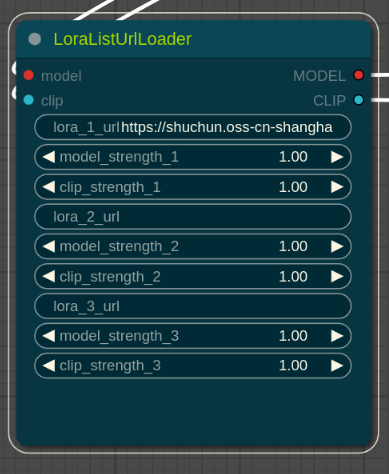

# Lora List with URL Loader

This plugin is used in our company to load online lora models.This plugin allows you to load LoRA models from a custom list, or automatically fetch them from url if they are missing locally. Key features include:

- **URL-based LoRA Loading**: Load LoRA models directly from URLs specified in your list.
- **Auto Fetch**: If a LoRA model is not found locally, it can be fetched automatically from Civitai.
- **Force Refresh**: (Not shown in the screenshot) You can force re-download and update the models even if they exist.
- **Flexible Renaming**: Uses SHA-256 hashing to validate the files, allowing you to rename them freely without breaking functionality.

## Installation

1. Navigate to the `custom_nodes` directory in your ComfyUI installation:
   ```bash
   cd custom_nodes
   ```
2. Clone the repository:

```bash
git clone https://github.com/liushuchun/ComfyUI_Lora_List_With_URL_Loader.git
```

3. install the dependencies:

```bash
   pip install -r requirements.txt
```

4. Restart ComfyUI to apply the changes.

## Config



